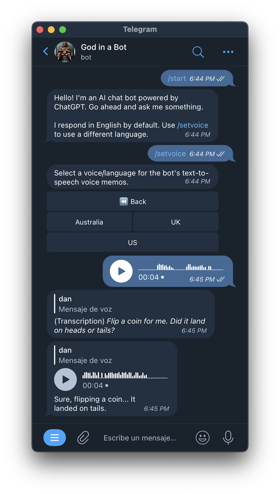

# telegram-chatgpt-bot

A self-hostable Telegram bot that lets you speak with ChatGPT through text and voice memos. Notably, you can send it voice memos and it can respond with voice memos.

**️⚠ Hotfix** Due to popularity, the demo bot rate-limits unauthorized users after 10 messages per reboot.

Demo bot: <https://t.me/god_in_a_bot> (Only supports 1:1 private convos)



## Commands

-   `/voice`: Choose the bot's language + voice for its voice memos
-   `/temp`: Change the temperature (randomness) of ChatGPT responses
-   `/voiceon`, `/voiceoff`: Toggle voice memos from the bot
-   `/info`: Show bot settings (current language, current temperature, voices on/off)
-   `/clear`: Clear the conversation context
-   `/prompt <prompt>`: Set a custom system prompt (`/clear` to see changes)
-   `/promptclear`: Reset prompt to bot default
-   `/model`: Change gpt model (Must configure `CAN_MANAGE_MODEL` env var for this to work)
-   `/retry`: Regenerate last bot answer
-   `/img <prompt>`: Generate a Dall-e image (note: unaffected by `/retry`)

## Features

This bot has become somewhat of a meandering kitchen sink since I've been having fun implementing stuff for my person use.

-   [x] **Two-way voice memos**. I really liked the idea of talking to ChatGPT with voice and then receiving voice responses, especially for practicing a different language.
-   [x] **Language/voice selection**. `/voice` gives you a inline menu for quickly changing the bot's voice + language.
-   [x] **Language autodetection**. If the bot is responding in a language different from the one configured with `/voice`, it uses a default voice in that language instead of forcing, for example, a Spanish voice to butcher German.
-   [x] **Streaming updates**. Similar to ChatGPT's online UI, tokens show up in the Telegram message as the bot receives them.
-   [x] **Custom system prompt**. Configure a custom system prompt for the current chat.
-   [x] **Supports multiple models**.
    -   `gpt-3.5-turbo` (default)
    -   `gpt-4`
    -   `text-davinci-003`
-   [x] Automatically change voice/language according to user prompt language.
    -   This is implemented by repeatedly updating the message as tokens are received.
-   [x] Dall-e image generation.
-   [ ] Group chat support. (Still need to figure out how it should work)

## Why Telegram?

I originally started this as a WhatsApp bot since my telco's data plan gives me unlimited WhatsApp data transfer, but unfortunately Twilio is too expensive to make it viable even for personal use. In just one hour of testing my bot, I owed Twilio $5 which made me consider another platform.

What about SMS? Well, SMS still requires Twilio, and it doesn't support voice memos. I would have considered an iMessage bot, but there's no good way to build a service that can talk to iMessage AFAIK.

It turns out Telegram is a great match for this project. It's free, has a nice bot API, and has thoughtful features like its inline keyboard/menu system.

## Conversation context and token limit

ChatGPT conversations work by sending historical messages back to the API along with the user's prompt.

The ChatGPT API has an context limit of 4096 tokens which isn't just the total size limit of the historical message + user prompt, but also the size of the answer. This means that if you send 4000 tokens of historical messages + user prompt, the maximum response that ChatGPT will generate is ~100 tokens. This makes it hard to tune the ideal history vs. response size.

For every user prompt and ChatGPT answer pair, I count the prompt tokens, get the answer tokens from the ChatGPT API response, and store the prompt/answer pair in the database along with their token count.

This lets me grab context by iterating backwards through historical prompt/answer pairs until I've accumulated a sufficient amount of tokens to send to the ChatGPT API. At the time of writing, I grab 4096-512 (3584) historical message tokens which leaves 512 tokens for the prompt + answer.

## Voice memos

When you send the bot a voice memo over Telegram, the server uses OpenAI's Whisper API to transcribe it into
text. That text is fed to the ChatGPT API to get a text response. The text response is then
turned into an audio file using Azure's Text-to-speech API.

The text and voice memo are then sent back to the Telegram conversation.

## Cost

The OpenAI and Azure text-to-speech APIs are cheap.

After a week of personal use, I've spent about a $1 on OpenAI's API for both GPT-3 chat completion and Whisper speech transcription.

I've spent $0 on Azure's text-to-speech API because the first five hours of audio generation every month are free.

A t2.nano EC2 server and RDS (database) costs <$3/month.

For personal use, you could even run the bot and database on an always-on computer at home and use a Cloudflare Tunnel to expose the bot to the internet. That means your only expense would be the OpenAI API.

## Install

Bot dependencies:

-   Node
-   Postgres
-   [OpenAI API](https://platform.openai.com/overview)
-   [Azure text-to-speech API](https://azure.microsoft.com/en-us/products/cognitive-services/text-to-speech/)

I personally have the bot running on a t2.nano EC2 instance talking to Postgres running on the cheapest AWS RDS instance.

My development bot runs on my laptop with a Cloudflare Tunnel exposing it at `https://chat.example.com/telegram` for easy testing.

Set up the Postgres database:

```
createdb telegram-chat-bot
psql -d telegram-chat-bot -f schema.sql
```

Set up the Node project:

```
git clone https://github.com/danneu/telegram-chatgpt-bot
cd telegram-chatgpt-bot
npm install
node index.js
```

However, the bot will not boot until you configure it.

## Configure environment variables

The bot expects the following environment variables.

You can put them in an `.env` file at the project root.

**Note:** The webhook url needs to have the path `/telegram` because that's currently hard-coded in the router.

```bash
# Required
DATABASE_URL="postgres://localhost/telegram-chat-bot"
TELEGRAM_BOT_TOKEN="xxx"
OPENAI_API_KEY="xxx"
AZURE_SPEECH_REGION="eastus"
AZURE_SPEECH_KEY="xxxx"
WEBHOOK_URL="https://yourserver.com/telegram"

# Optional (Defaults shown)
PORT=8080
MASTER_PROMPT="Be as brief as possible. Do not write anything except the answer to the question. For example, do not say that you don't have an opinion on something nor that there are many answers to a question. Instead, choose a random believable answer."
CAN_MANAGE_MODEL=
```

## Enable model switching

Because `gpt-4` and `text-davinci-003` are expensive, the bot uses the `gpt-3.5-turbo` model and doesn't let anybody change it unless you've configured `CAN_MANAGE_MODEL` to give Telegram users this permission.

Set a comma-delimited list of Telegram IDs to only allow certain Telegram IDs to use the `/model` command:

```bash
CAN_MANAGE_MODEL="1234"
CAN_MANAGE_MODEL="1111,2222,3333"
CAN_MANAGE_MODEL="*" # Anyone can set /model
```

You can send the bot `/whoami` to get your Telegram ID.

## Simultaneous request rate-limiting

It's useful to be able to ask the bot multiple questions at a time since it takes the bot a while to respond.

However, there's a naive in-process check to prevent a user from having more than three inflight requests at once.

## Demo bot rate-limiting

Due to popularity, I added a crude measure that rate-limits guests (i.e. users not approved by the `CAN_MANAGE_MODEL` env var) after 10 messages per reboot.

Until I hash out a better system, if you run the bot yourself, you must configure `CAN_MANAGE_MODEL` to avoid the rate-limit.

I don't intend to use `CAN_MANAGE_MODEL` as a global whitelist, but it's a quick hack.

## License

MIT
